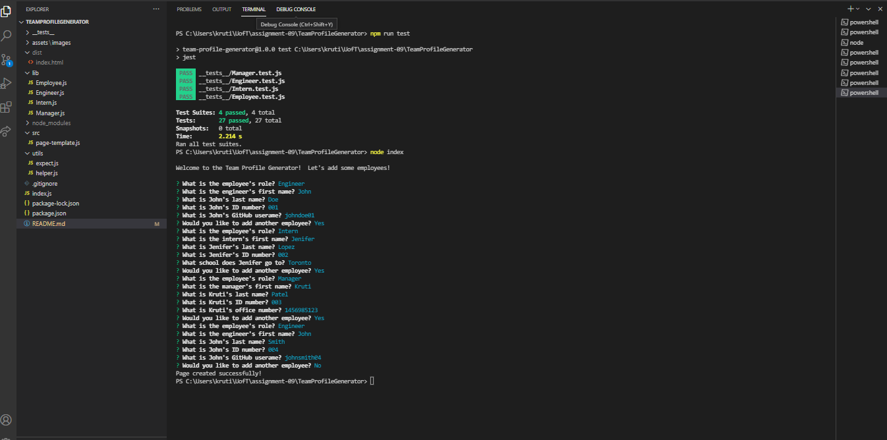
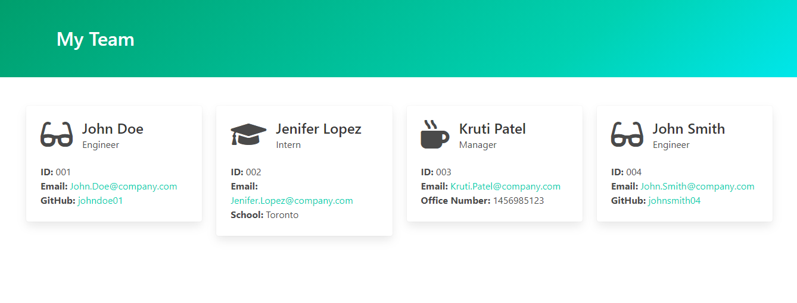

# Team Profile Generator
[](https://github.com/deckiedevs/team-profile-generator/issues) [](https://github.com/deckiedevs/team-profile-generator/graphs/contributors) 

## Description
A Node.js application to create a simple webpage featuring your development team's roster.

## Contents
* [Installation](#Installation)
* [Usage](#Usage)
   * [Video Demo](#Video-Demo)
   * [Screenshots](#Screenshots)
* [Tests](#Tests)
* [Questions](#Questions)
* [Credits](#Credits)


## Installation
To use this application, please install: 
```
npm install inquirer
```
    
## Usage
After cloning the repo and installing the required npm packages, use the command line to navigate to the root of the application and run `node index`.  Follow prompts to add team members to your roster.  Only one manager can be added per team.  Your generated team roster page will be created in the `./dist` folder. 
    
### Video Demo
A video demonstration of the application can be found on [YouTube](https://youtu.be/8zsKlPwDZSE).

### Screenshots

The application runs from the command line as seen above.
<br/><br/>

An example of the generated team roster page.


## Tests
To run tests on the application, install
```
npm install jest
```

and run `npm run test` from the command line.
    
## Questions
If you have any questions about the repo, please [open an issue](https://github.com/deckiedevs/team-profile-generator/issues) or contact me via email at deckiedevs@gmail.com. You can find more of my work on my GitHub, [deckiedevs](https://github.com/deckiedevs/).
    
## Credits
* Styles for the generated page powered by [Bulma](https://bulma.io/).
* Employee icons furnished by [Font Awesome](https://fontawesome.com/).
* Encouragement and solidarity provided by Curtis Lane, TA extrordinaire. 
* Application created by Mila Decker with manic highs and depressive lows.